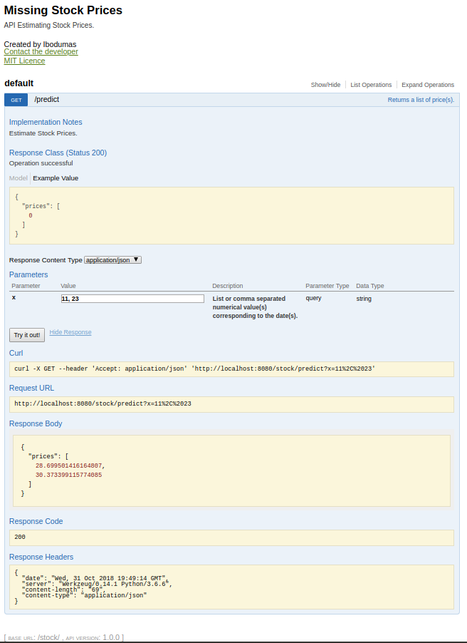

# Missing Stock Prices
A time series of a stock's highest price during a trading day (at the New York Stock Exchange), is provided. In each test case, the day's highest prices is missing for certain days. By analyzing the data, I will try to identify the missing price for those particular days.

#### Directories:
- my_hackerrank_solution: shows my accepted code on Hackerrank.
- model: is a broad implementation of the project.
- jupy_note: is a Jupyter notebook version of the project.
- unit_test: for testing some of the models. 

#### Models are:
- Spline Interpolation
- Polynomial Interpolation
- Ridge(regularised) Linear Regression
- Ridge(regularised) Linear Regression (PolynomialFeatures)
- Times Series Analysis: FaceBook Prophet Library  
&nbsp;&nbsp;&nbsp; - https://facebook.github.io/prophet/docs/quick_start.html 
&nbsp;&nbsp;&nbsp; - https://github.com/facebook/prophet

#### To easily replicate the project:
Run "pipenv shell" from the project root directory, this will create a VIRTUAL ENVIRONMENT and install all dependencies in it.

#### Model Deployment
A RESTful API with OpenAPI 2.0 specifications was developed to interface the best trained model for price prediction.
The API allows HTTP GET, with x as query string.

Parameters:  
x - Array or comma separated numerical value(s) corresponding to the date(s). This value is expected to be within the date range used during model training.  
- e.g [11, 23] or
- 11, 23

Response Body  
{ 
  &nbsp;&nbsp;&nbsp;&nbsp; "price": [  
  &nbsp;&nbsp;&nbsp;&nbsp;&nbsp;&nbsp;&nbsp;&nbsp;&nbsp; 28.699501416164807,  
  &nbsp;&nbsp;&nbsp;&nbsp;&nbsp;&nbsp;&nbsp;&nbsp;&nbsp; 30.373399115774085  
  &nbsp;&nbsp;&nbsp;&nbsp;&nbsp;]   
} 

Run wsgi.py to initiate the RESTfull API. Default port is 8080. OR run with gunicorn --bind 0.0.0.0:8080 wsgi:API
